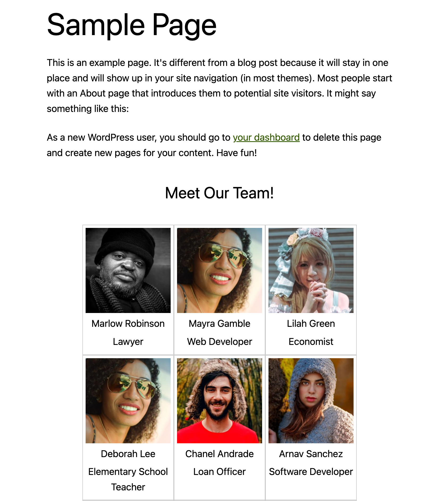

# Technical Challenge

## Goal

Modify the existing code in `wordpress/wp-content/plugins/custom-plugin` in order to create a custom WordPress Block.

## Requirements

- The custom Block should query WordPres itself using a custom Action.
- The custom Action should query the backend user API and relay the data. More info on the API can be found in the [README](README.md)

## Example Mockup

